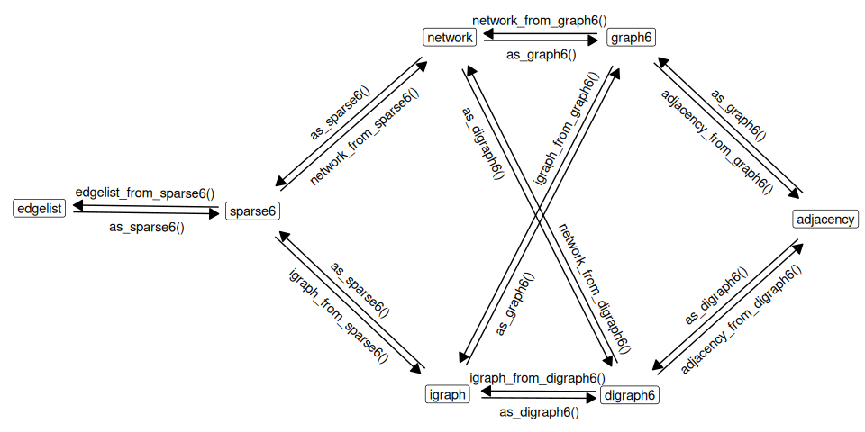

<!-- README.md is generated from README.Rmd. Please edit that file -->

# `rgraph6`: Representing Graphs as graph6, digraph6 or sparse6 Strings 

<!-- badges: start -->

[](https://github.com/mbojan/rgraph6/actions/workflows/R-CMD-check.yaml)
[](https://cranlogs.r-pkg.org/)
[](https://cran.r-project.org/package=rgraph6)
[](https://mbojan.r-universe.dev)
<!-- badges: end -->

Functions in this package allow for encoding network data as strings of
printable ASCII characters and back using ‘graph6’, ‘sparse6’, and
‘digraph6’ formats. This is convenient in a number of contexts,
especially when working with large number of graphs. Provided functions
allow to directly encode and decode graph data in the form of adjacency
matrices, edgelists, network objects and igraph objects to and from
these three formats.

## What are ‘graph6’, ‘sparse6’ and ‘digraph6’ formats?

‘graph6’, ‘sparse6’ and ‘digraph6’ are formats for encoding graphs as
strings of printable ASCII characters due to [Brendan
McKay](https://en.wikipedia.org/wiki/Brendan_McKay). See
[here](http://users.cecs.anu.edu.au/~bdm/data/formats.txt) for format
specification. Formats ‘graph6’ and ‘sparse6’ are for undirected graphs.
Format ‘digraph6’ is for directed graphs.

## Functions

Main functions for encoding network data are:

- `as_graph6()`
- `as_sparse6()`
- `as_digraph6()`

Main functions for decoding are:

- `adjacency_from_text()`
- `edgelist_from_text()`
- `igraph_from_text()`
- `network_from_text()`

Low-level functions are shown on the following graph:



## Examples

### Encode list of igraph objects

Generate a list of igraph objects:

``` r
set.seed(666)
igraph_list <- replicate(5, igraph::sample_gnp(10, 0.1, directed = FALSE),
  simplify = FALSE
)
```

Encode as ‘graph6’ symbols:

``` r
as_graph6(igraph_list)
#> [1] "ICG_@?W??" "I????@B?G" "I?@O????W" "I@@A?E???" "I?_?_@_??"
```

Encode as ‘sparse6’ symbols:

``` r
as_sparse6(igraph_list)
#> [1] ":IeASjaeR" ":IoCp{^"   ":IiC]Rg"   ":IeIgWu`"  ":IgAo{@D"
```

### Decode a vector of different types of symbols

Using example data `g6`, `d6`, and `s6` provided with the package:

``` r
# Create a vector with a mixture of 'graph6', 'digraph6' and 'sparse6' symbols
x <- c(g6[1], s6[2], d6[3])
x
#> [1] "N??E??G?e?G?????GGO"                     
#> [2] ":NkF?XduSqiDRwYU~"                       
#> [3] "&N?R_?E?C?D??U_A????????O???????????????"

# Parse to igraph objects (package igraph required)
igraph_from_text(x)
#> [[1]]
#> IGRAPH 4a2f1fa U--- 15 10 -- 
#> + edges from 4a2f1fa:
#>  [1]  1-- 7  1--11  2-- 7  2--11  2--12  2--15  5-- 9  7--10  8--15 13--15
#> 
#> [[2]]
#> IGRAPH f21cde8 U--- 15 13 -- 
#> + edges from f21cde8:
#>  [1]  2-- 7  2-- 9  4--10  6--10  6--12  7--12 11--12  5--13  6--13 10--13
#> [11]  4--15 10--15 14--15
#> 
#> [[3]]
#> IGRAPH 67f19fc D--- 15 15 -- 
#> + edges from 67f19fc:
#>  [1] 1-> 8 1->11 1->12 1->13 2->13 2->14 3->10 4-> 7 4-> 9 5-> 8 5->10 5->11
#> [13] 5->13 6-> 8 9->14

# Parse to network objects (package network required)
network_from_text(x)
#> Loading required namespace: network
#> [[1]]
#>  Network attributes:
#>   vertices = 15 
#>   directed = FALSE 
#>   hyper = FALSE 
#>   loops = FALSE 
#>   multiple = FALSE 
#>   bipartite = FALSE 
#>   total edges= 10 
#>     missing edges= 0 
#>     non-missing edges= 10 
#> 
#>  Vertex attribute names: 
#>     vertex.names 
#> 
#> No edge attributes
#> 
#> [[2]]
#>  Network attributes:
#>   vertices = 15 
#>   directed = FALSE 
#>   hyper = FALSE 
#>   loops = FALSE 
#>   multiple = FALSE 
#>   bipartite = FALSE 
#>   total edges= 13 
#>     missing edges= 0 
#>     non-missing edges= 13 
#> 
#>  Vertex attribute names: 
#>     vertex.names 
#> 
#> No edge attributes
#> 
#> [[3]]
#>  Network attributes:
#>   vertices = 15 
#>   directed = TRUE 
#>   hyper = FALSE 
#>   loops = FALSE 
#>   multiple = FALSE 
#>   bipartite = FALSE 
#>   total edges= 15 
#>     missing edges= 0 
#>     non-missing edges= 15 
#> 
#>  Vertex attribute names: 
#>     vertex.names 
#> 
#> No edge attributes
```

### Tidy graph databases

The formats shine if we need to store large number of graphs in a data
frame. Let’s generate a list of random graphs as igraph objects and
store them in a data frame column of graph6 symbols:

``` r
library("dplyr")

# Generate list of igraph objects
set.seed(666)

d <- tibble::tibble(
  g6 = replicate(
    10,
    igraph::sample_gnp(sample(3:12, 1, replace = TRUE), p = .5, directed = FALSE),
    simplify = FALSE
  ) %>%
    as_graph6()
)
d
#> # A tibble: 10 × 1
#>    g6         
#>    <chr>      
#>  1 FSOT_      
#>  2 JYNALTg{fE?
#>  3 JWwbmJNOfX_
#>  4 Gr|Kto     
#>  5 IftZ~cXPo  
#>  6 H`i@]us    
#>  7 FClsO      
#>  8 IlPd`~fbg  
#>  9 BG         
#> 10 GFnwpW
```

Nice and compact. We can go further by doing some computations and
saving the results together with the graph data, and even save it to a
simple CSV file!

``` r
d %>%
  dplyr::mutate(
    igraphs = igraph_from_text(g6),
    vc = purrr::map_dbl(igraphs, igraph::vcount),
    ec = purrr::map_dbl(igraphs, igraph::ecount),
    density = purrr::map_dbl(igraphs, igraph::edge_density)
  ) %>%
  dplyr::select(-igraphs) %>%
  write.csv(row.names = FALSE)
#> "g6","vc","ec","density"
#> "FSOT_",7,7,0.333333333333333
#> "JYNALTg{fE?",11,26,0.472727272727273
#> "JWwbmJNOfX_",11,28,0.509090909090909
#> "Gr|Kto",8,17,0.607142857142857
#> "IftZ~cXPo",10,27,0.6
#> "H`i@]us",9,17,0.472222222222222
#> "FClsO",7,9,0.428571428571429
#> "IlPd`~fbg",10,26,0.577777777777778
#> "BG",3,1,0.333333333333333
#> "GFnwpW",8,16,0.571428571428571
```

## Installation

<!--
Install released version from CRAN with:
&#10;
``` r
install.packages("rgraph6")
```
-->

Install development version from GitHub with:

``` r
# install.packages("remotes")
remotes::install_github("mbojan/rgraph6", build_vignettes = TRUE)
```

Nightly Windows and MacOS binaries are available on [R
Universe](https://mbojan.r-universe.dev):

``` r
install.packages("rgraph6", repos = "https://mbojan.r-universe.dev")
```

## Authors, contributors and citation

**Author and maintainer**: Michal Bojanowski <michal2992@gmail.com>
(<https://orcid.org/0000-0001-7503-852X>, Kozminski University).

**Co-authors**: David Schoch (<https://orcid.org/0000-0003-2952-4812>)

To cite this package please use the following two entries:

Bojanowski M, Schoch D (2024). *rgraph6: Representing Graphs as
‘graph6’, ‘digraph6’ or ‘sparse6’ Strings*. R package version 2.0-4,
<https://mbojan.github.io/rgraph6/>.

McKay, B. D., & Piperno, A. (2014). Practical graph isomorphism, II.
*Journal of Symbolic Computation*, 60, 94-112.
